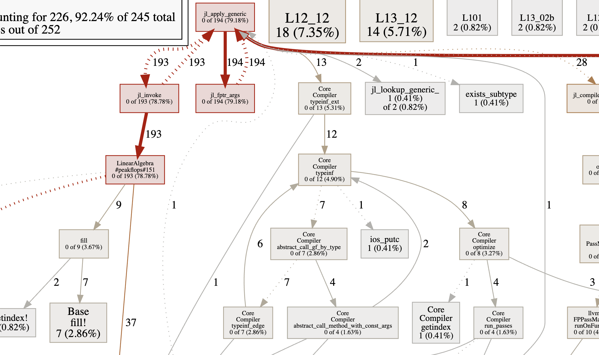
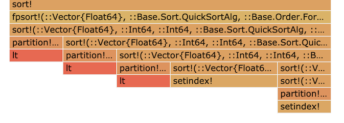

# PProf.jl

[](https://travis-ci.com/vchuravy/PProf.jl)


*Sometimes I need a hammer, sometimes I need a drill, this is a hammer-drill*

```julia
using Profile
using PProf

# collect a profile
@profile peakflops()

# Export pprof profile and open interactive profiling web interface.
pprof()
```

This prints a link to a local webserver where you can inspect the profile you've collected. It produces a file called `profile.pb.gz` in the [`pprof`](https://github.com/google/pprof) format, and then opens the `pprof` tool in interactive "web" mode.

For more usage examples see the pprof docs: https://github.com/google/pprof/blob/master/doc/README.md

## Dependencies
- [Graphviz](https://www.graphviz.org/)
    - In order to use pprof's web graph view (which is one of the best parts of pprof), you need to have graphviz installed. Click the above link to install.

## Usage
```julia
help?> pprof
  pprof(data, period;
          web = true, webhost = "localhost", webport = 57599,
          out = "profile.pb.gz", from_c = true, drop_frames = "", keep_frames = "")

  Fetches and converts Profile data to the pprof format.
```
```julia
help?> @pprof
  @pprof ex

  Profiles the expression using @profile and starts or restarts pprof.
```

Calling `pprof()` or `@pprof` exports the profiling results to disk, and launches the web server in the background pointed at the results. Calling it again overwrites the results and refreshes the server, so you can reload the web-page to see your updated results. The link to the webserver is printed to your terminal, which you can then open in a browser.

If you manually modify the output profile file, you can _refresh_ the web server without overwriting the `out` file by calling `PProf.refresh()`.

## Example
```julia
julia> using PProf

julia> @pprof peakflops()
"profile.pb.gz"

Main binary filename not available.
Serving web UI on http://localhost:57599
```


## Google PProf Web View



